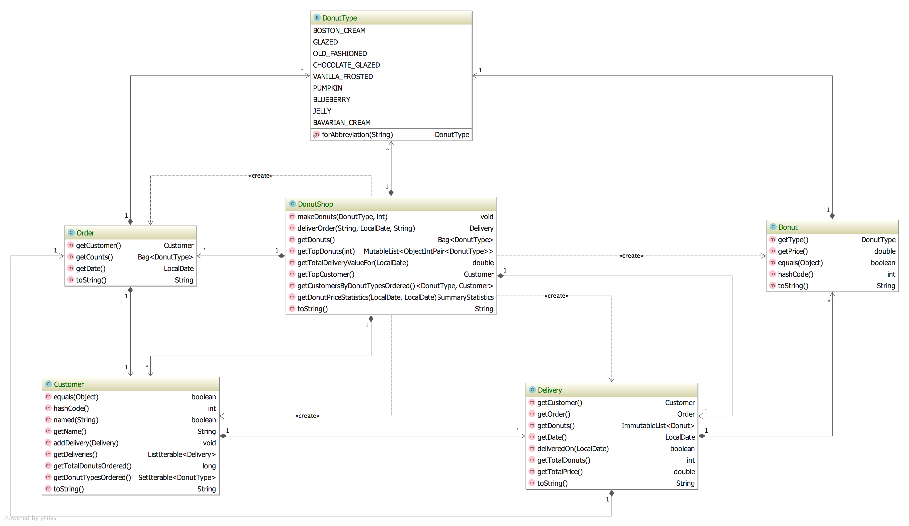

# **What is the Donut Code Kata?**

The Donut Kata is an advanced kata which can help developers
become familiar with lesser known APIs of Eclipse Collections.  

The domain for the kata is a Donut Shop.  There are several domain
classes that are shared by all of the exercises.  These are 
[`DonutType`](./src/main/java/bnymellon/codekatas/donutkata/DonutType.java), 
[`Donut`](./src/main/java/bnymellon/codekatas/donutkata/Donut.java),
[`DonutShop`](./src/main/java/bnymellon/codekatas/donutkata/DonutShop.java),
[`Customer`](./src/main/java/bnymellon/codekatas/donutkata/Customer.java),
[`Order`](./src/main/java/bnymellon/codekatas/donutkata/Order.java) and
[`Delivery`](./src/main/java/bnymellon/codekatas/donutkata/Delivery.java).  

 

### How to get started

* There are failing tests in [`DonutShopTest`](./src/test/java/bnymellon/codekatas/donutkata/DonutShopTest.java)
	* Make the tests pass by following and completing the TODOs in [`DonutShop`](./src/main/java/bnymellon/codekatas/donutkata/DonutShop.java) 