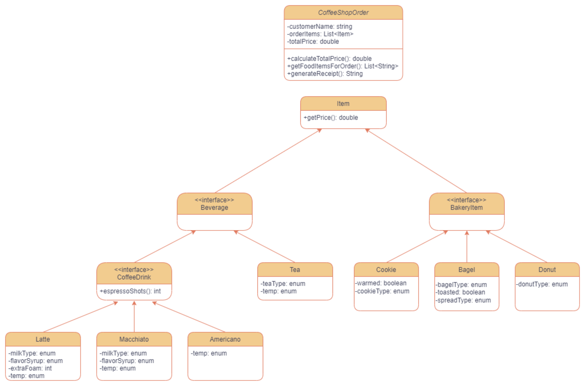

## What is the Coffee Shop Kata? ##

The Coffee Shop Kata exercise is designed to provide a hands-on experience in learning and demonstrating the usage of latest
Java features while comparing them with older.

The domain for the kata is a Coffee Shop. There are several domain
classes that are shared by all the exercises. These are
[`Items`](jdk8/src/main/java/bny/codekatas/coffeeshopkata/Item.java),
[`CoffeeShopOrder`](jdk8/src/main/java/bny/codekatas/coffeeshopkata/CoffeeShopOrder.java),
[`Beverage`](jdk8/src/main/java/bny/codekatas/coffeeshopkata/beverage/Beverage.java),
[`Tea`](jdk8/src/main/java/bny/codekatas/coffeeshopkata/beverage/Tea.java),
[`CoffeeDrink`](jdk8/src/main/java/bny/codekatas/coffeeshopkata/beverage/CoffeeDrink.java),
[`Latte`](jdk8/src/main/java/bny/codekatas/coffeeshopkata/beverage/Latte.java),
[`Macchiato`](jdk8/src/main/java/bny/codekatas/coffeeshopkata/beverage/Macchiato.java),
[`Americano`](jdk8/src/main/java/bny/codekatas/coffeeshopkata/beverage/Americano.java),
[`BakeryItem`](jdk8/src/main/java/bny/codekatas/coffeeshopkata/food/BakeryItem.java),
[`Cookie`](jdk8/src/main/java/bny/codekatas/coffeeshopkata/food/Cookie.java),
[`Bagel`](jdk8/src/main/java/bny/codekatas/coffeeshopkata/food/Bagel.java), and
[`Donut`](jdk8/src/main/java/bny/codekatas/coffeeshopkata/food/Donut.java).

## Overview ##
The following Java concepts will be useful in completing the kata:
* [Records](https://openjdk.org/jeps/395)
* [Record patterns](https://openjdk.org/jeps/440)
* [Pattern matching for switch](https://openjdk.org/jeps/441)
* [Sealed classes](https://openjdk.org/jeps/409)
This kata involves refactoring existing code and implementing missing code! All the code you need to complete is in
the [`jdk21`](./jdk21) module, with the corresponding solutions
in [`coffee-shop-kata-solutions`](../coffee-shop-kata-solutions). The
purpose of the [`jdk8`](./jdk8) module is to show you the Java 8 way of solving these
problems; there are no TODOs in this module. For technical setup, follow the instructions in [`SETUP.md`](./SETUP.md)!

## Getting started ##

1. Run the Tests in [CoffeeShopTest](jdk21/src/test/java/bny/codekatas/coffeeshopkata/CoffeeShopTest.java)
2. Fix the Code Using "TODO" and "HINT" Comments
3. Repeat step 1 and 2 until all tests pass