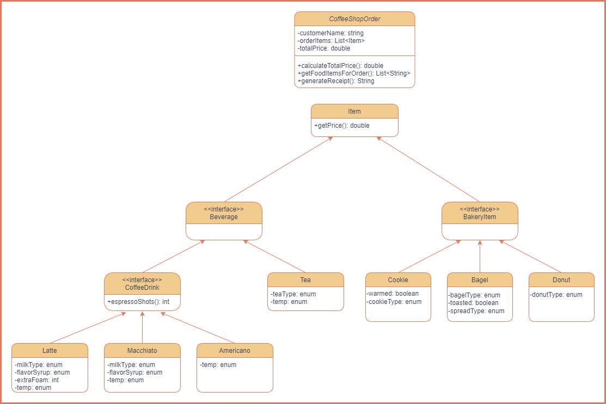

## What is the Coffee Shop Kata? ##

The Coffee Kata exercise is designed to provide a hands-on experience in learning and demonstrating the usage of latest
Java features while comparing them with older.

The domain for the kata is a Coffee Shop. There are several domain
classes that are shared by all the exercises. These are
[`Items`](src/main/java/bnymellon/codekatas/coffeeshopkata/Item.java),
[`CoffeeShopOrder`](src/main/java/bnymellon/codekatas/coffeeshopkata/CoffeeShopOrder.java),
[`Beverage`](jdk8/src/main/java/bnymellon/codekatas/coffeeshopkata/beverage/Beverage.java),
[`Tea`](jdk8/src/main/java/bnymellon/codekatas/coffeeshopkata/beverage/Tea.java),
[`CoffeeDrink`](jdk8/src/main/java/bnymellon/codekatas/coffeeshopkata/beverage/CoffeeDrink.java),
[`Latte`](jdk8/src/main/java/bnymellon/codekatas/coffeeshopkata/beverage/Latte.java),
[`Macchiato`](jdk8/src/main/java/bnymellon/codekatas/coffeeshopkata/beverage/Macchiato.java),
[`Americano`](jdk8/src/main/java/bnymellon/codekatas/coffeeshopkata/beverage/Americano.java),
[`BakeryItem`](jdk8/src/main/java/bnymellon/codekatas/coffeeshopkata/food/BakeryItem.java),
[`Cookie`](jdk8/src/main/java/bnymellon/codekatas/coffeeshopkata/food/Cookie.java),
[`Bagel`](jdk8/src/main/java/bnymellon/codekatas/coffeeshopkata/food/Bagel.java), and
[`Donut`](jdk8/src/main/java/bnymellon/codekatas/coffeeshopkata/food/Donut.java).

## Getting Started ##
This kata involves refactoring existing code and implementing missing code! In the [`new-java-features`](./new-java-features) module, you will find a test class called [bnymellon.codekata.coffeeshopkata.CoffeeShopTest](src/test/java/bnymellon/codekata/coffeeshopkata/jdk21/bnymellon.codekata.coffeeshopkata.CoffeeShopTest.java). Each test case contains a TODO that needs to be completed in order to make the code pass. All the code you need to complete is in the [`new-java-features`](./new-java-features) module, with the corresponding solutions in [`coffee-shop-kata-solutions/new-java-features`](../coffee-shop-kata-solutions/new-java-features-solutions). The purpose of the [`old-java-features`](./old-java-features) module is to show you the Java 8 way of solving these problems; there are no TODOs in this module. For technical setup, follow the instructions in [`SETUP.md`](./SETUP.md)! 